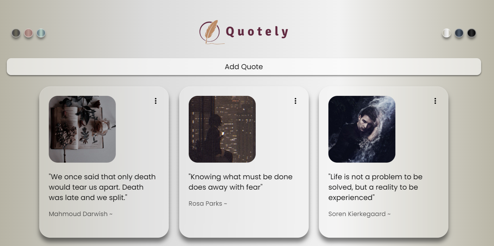
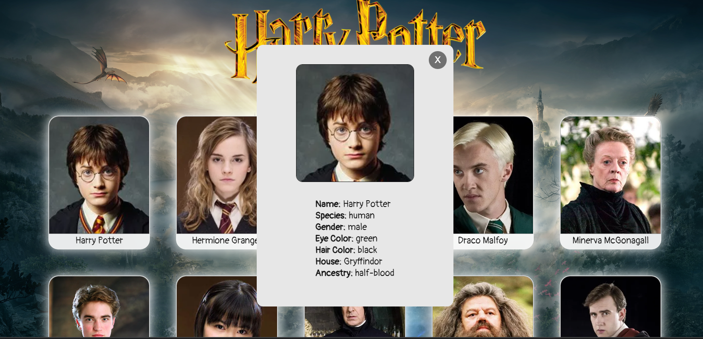
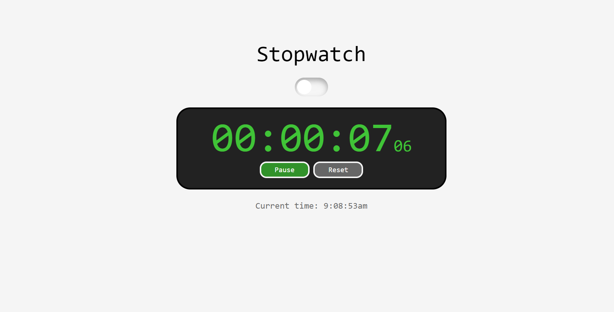
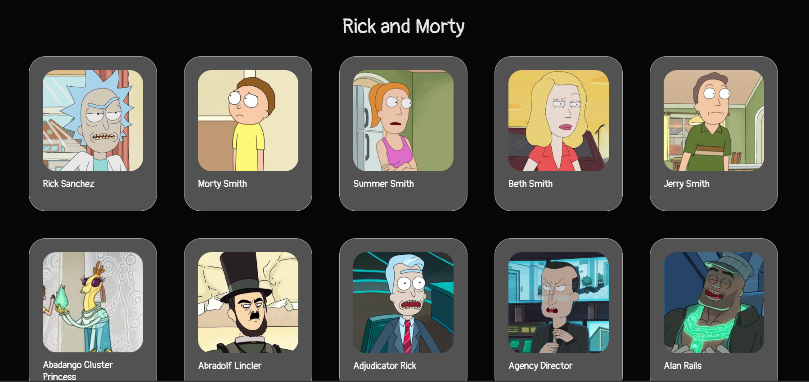
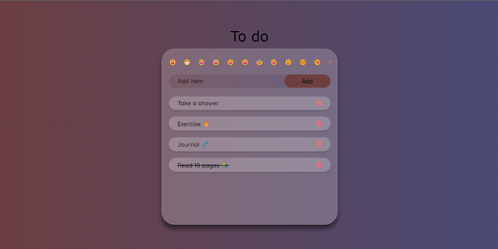
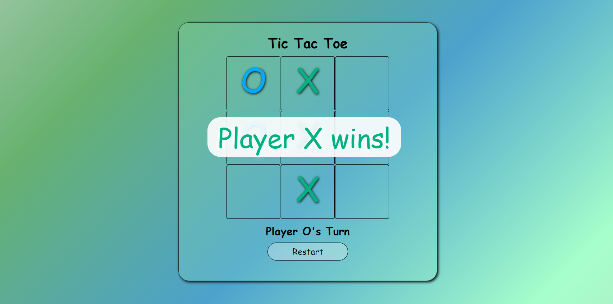
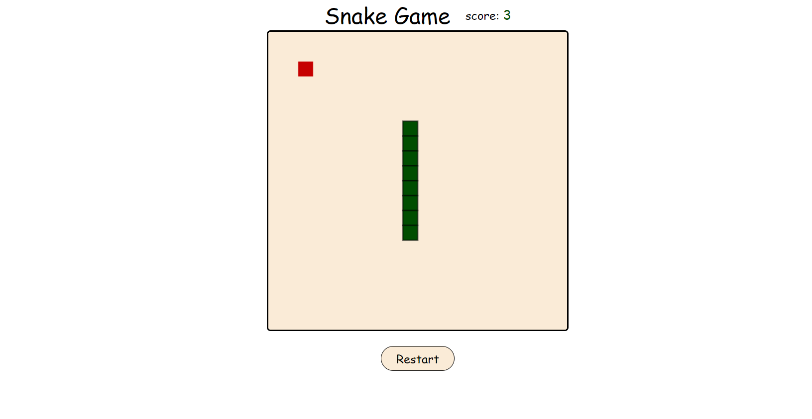

# Javascript-Projects

Here are some of my projects made using HTML, CSS and Javascript

<a href="https://bushraaksoy.github.io/Javascript-Projects/quotely-js/">Quotely<a/>

<a href="https://bushraaksoy.github.io/Javascript-Projects/harry-potter/">Harry Potter<a/>

<a href="https://bushraaksoy.github.io/Javascript-Projects/stopwatch/">Stopwatch<a/>

<a href="https://bushraaksoy.github.io/Javascript-Projects/RickAndMorty/">Rick and Morty<a/>

<a href="https://bushraaksoy.github.io/Javascript-Projects/Todo/">To-Do<a/>

<a href="https://bushraaksoy.github.io/Javascript-Projects/tictactoe/">Tic-Tac-Toe<a/>

<a href="https://bushraaksoy.github.io/Javascript-Projects/snake-game/">Snake Game<a/>

